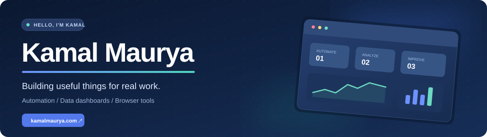

  

  <a href="https://kamalmaurya.com">🌐 Portfolio</a> &nbsp;·&nbsp;
  <a href="#selected-projects">✦ Projects</a> &nbsp;·&nbsp;
  <a href="mailto:mauryarkamal@gmail.com">✉️ Get in touch</a>

I build practical tools that make everyday work clearer, faster, and more reliable. My projects range from workflow automation to data dashboards and browser extensions.

### What I work on

| ⚙️ Automation | 📊 Dashboards | 🧩 Browser tools |
| :--- | :--- | :--- |
| Turning repeated steps into dependable workflows. | Making operational data easier to explore and act on. | Putting useful actions directly into the browser. |

<!-- profile-updater:start -->
## Selected projects

A selection of tools I have built to solve practical problems.

|  |  |
| :--- | :--- |
| **01 · WORKFLOW TOOL**  **[Activity Management System](https://kamalmaurya.com/project-activity-management.html)**  A central workspace for tracking employee activities, leave, engagement, and productivity.  *Workflow tool · Dashboard*  [Case study ↗](https://kamalmaurya.com/project-activity-management.html) | **02 · DASHBOARD**  **[Conference Call Tracker Dashboard](https://kamalmaurya.com/project-conference-call-tracker.html)**  A dashboard for monitoring conference calls across teams, schedules, coverage, and operational gaps.  *Dashboard · Data pipeline*  [Case study ↗](https://kamalmaurya.com/project-conference-call-tracker.html) |
| **03 · PYTHON**  **[Scorecard Email Sender](https://kamalmaurya.com/project-scorecard-email-sender.html)**  Creates standardized scorecard emails in bulk from Excel workbooks.  *Python · Automation*  [Case study ↗](https://kamalmaurya.com/project-scorecard-email-sender.html) | **04 · AUTOMATION**  **[Data Collection Automation](https://kamalmaurya.com/project-data-collection-automation.html)**  Automates repetitive data collection tasks to reduce manual effort.  *Automation · Data processing*  [Case study ↗](https://kamalmaurya.com/project-data-collection-automation.html) |
| **05 · DATA QUALITY**  **[PQR Tool: Productivity Quality and Review](https://kamalmaurya.com/project-p-q-r.html)**  Validates documents during collection to improve productivity and data quality.  *Data quality · Workflow tool*  [Case study ↗](https://kamalmaurya.com/project-p-q-r.html) | **06 · AUTOMATION**  **[Expected Event Checks Automation](https://kamalmaurya.com/project-expected-checks.html)**  Checks expected events and conference calls to catch missing or inaccurate data.  *Automation · Data quality*  [Case study ↗](https://kamalmaurya.com/project-expected-checks.html) |
| **07 · CHROME EXTENSION**  **[Translation Support Chrome Extension](https://kamalmaurya.com/project-strikethrough-extension.html)**  Marks incorrect phrases on web pages and shows corrections inline.  *Chrome extension · Content review*  [Case study ↗](https://kamalmaurya.com/project-strikethrough-extension.html) | **08 · CHROME EXTENSION**  **[Search Highlight &amp; Enlist Chrome Extension](https://kamalmaurya.com/project-search-highlight-extension.html)**  Finds, highlights, and enumerates keywords in documents inside the browser.  *Chrome extension · Research*  [Case study ↗](https://kamalmaurya.com/project-search-highlight-extension.html) |
| **09 · AI**  **[AI Stock Analysis](https://kamalmaurya.com/project-bse-ai-analysis.html)**  Combines machine learning and technical indicators to simplify stock evaluation.  *AI · Dashboard*  [Case study ↗](https://kamalmaurya.com/project-bse-ai-analysis.html) | &nbsp; |

<!-- profile-updater:end -->

  <strong>Want the full story behind a project?</strong> 
  Explore the <a href="https://kamalmaurya.com">portfolio and case studies</a>.

